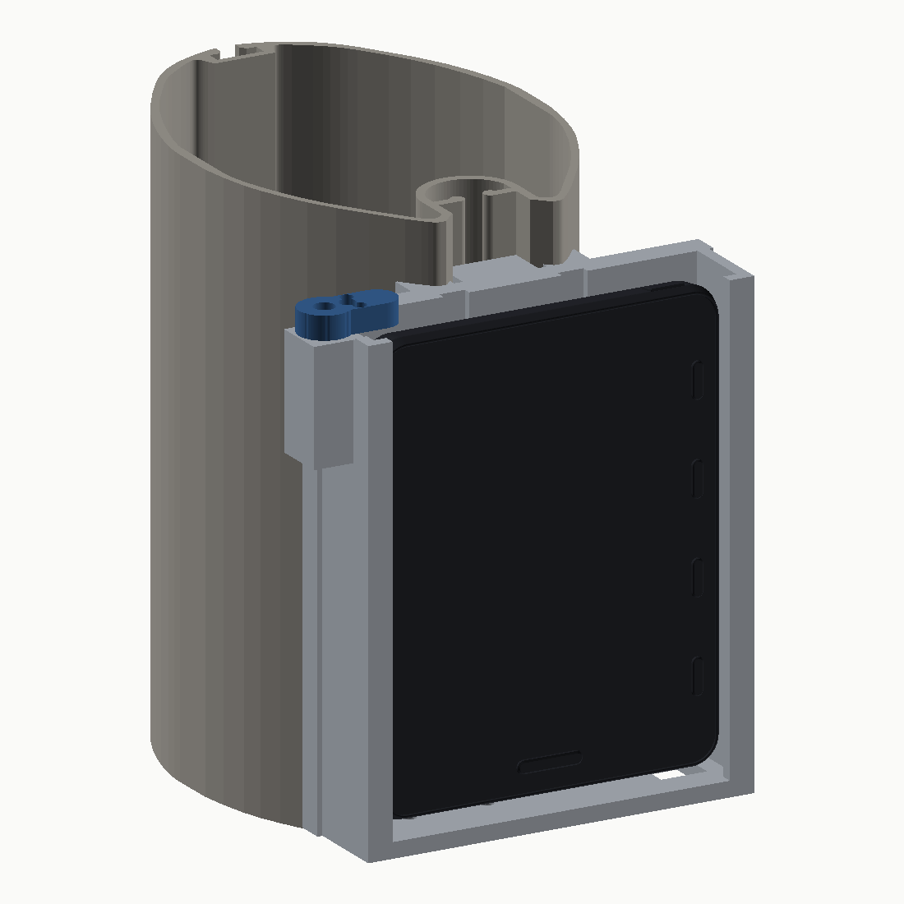

# Vakaros Atlas 2 — Express mast mount

A two-part printed mount that bolts into the **forward T-slot** of an Express
section mast and holds a Vakaros Atlas 2 in a hinged, thumbscrew-locked
clamshell. Screen stays fully visible; every control and the charge port stays
reachable with the device locked in.

Generated parametrically from the supplied CAD — `src/atlas2_mast_mount.py`
re-reads `reference/Mast.step` and `reference/Atlas_2.step` on every run and
derives the mating geometry from them, so nothing is hand-transcribed.



## Parts

| Part | File | Notes |
|---|---|---|
| Back plate | `export/back_plate.step` / `.stl` | Mast saddle + device backing, 109 cm³ |
| Front shell | `export/front_shell.step` / `.stl` | Hinged clamshell, 25 cm³ |
| Toggle nut ×2 | `export/toggle_nut.step` / `.stl` | Retrofit option — fits through the slot throat |
| Slide nut bar | `export/slide_nut_bar.step` / `.stl` | Preferred — drops in from the mast head |
| Thumbscrew knob ×2 | `export/thumbscrew_knob.step` / `.stl` | Captures an M3 hex head |
| Assemblies | `export/assembly_*.step` | Mount alone, and mount + mast + device |

Overall: back plate 113.5 × 124.0 × 18.6 mm, shell 113.5 × 122.2 × 21.5 mm.
The device screen ends up **22.65 mm** forward of the mast nose.

## Design

| Feature | Detail |
|---|---|
| Mast interface | Conforming saddle, 38 mm of contact across the nose, 0.4 mm clearance |
| Mast fixing | 2 × **M4** T-slot bolts at 70 mm centres, counterbored flush |
| Nose wall | 8 mm through the bolt line |
| Back plate core | 7 mm; local 9 mm bosses at the insert ears |
| Device clearance | 0.3 mm lateral, 0.2 mm in depth |
| Rear relief | Two 2 mm channels for the Atlas's rear protrusions |
| Front | Fully open — all four front buttons and the whole screen exposed |
| Retention | 3 mm lip down each side, overlapping the bezel by 3 mm |
| Top | 9 × 7.4 mm notch over the measured power-button position |
| Bottom | 12 × 13.5 mm notch over the measured charge port, open forward for a plug |
| Drainage | 2 × Ø4 mm holes in the bottom wall |
| Hinge | 3-knuckle, 3 mm pin, axis on the parting plane so the lid clears at any angle |
| Lock | 2 × M3 thumbscrews at 60 mm centres into brass heat-set inserts |
| Walls | 3 mm minimum throughout |

**The mast bolts sit under the device.** Once the Atlas is in and the
thumbscrews are done up, the mount cannot be unbolted from the mast without
first opening the clamshell.

## Three findings that changed the plan

Each of these came out of measuring the CAD, and each one would have produced a
part that did not work.

### 1. M5 will not fit the mast slot — this uses M4

The forward T-slot throat measures **exactly 5.000 mm**, and the section
drawing tolerances it at `5±0.5`. An M5 screw has a 5.0 mm major diameter, so
it cannot pass the throat — and on a slot at the bottom of tolerance it would
be 0.5 mm oversize. **M4 is used instead**, giving 1.0 mm of clearance in the
nominal slot and 0.5 mm in the worst case.

M4 also suits the nut: the internal channel is only 3.5 mm deep, so the nut can
be at most ~3.2 mm thick. M4 through 3.2 mm is 0.8 × D of thread engagement;
M5 would be 0.64 × D.

Change it in one place if you want to revisit this — `MAST_BOLT` in
`src/atlas2_mast_mount.py`. Nothing else needs touching.

### 2. The four buttons are on the front face, not the side

They sit in a column 5 mm in from the right-hand edge and stand 0.35 mm proud
of the bezel. A side cutout would have missed them entirely, and the planned
corner retaining tabs would have landed on top of them.

Retention is therefore a **full-height lip down each side** instead of corner
tabs. It stops 1.95 mm clear of the buttons, and because the front glass is
recessed 1.55 mm below the bezel the lip never touches the screen.

The power button and charge port are on the top and bottom edges but **offset
to the same side as the buttons**, not centred — so both notches are placed on
their measured positions rather than centrally.

### 3. The Atlas does not have a flat back

Two protrusions stand 1.16 mm proud of the rear plateau, diagonally opposite
(Xa ±13.2…17.0). Sitting the device on a flat plate would have left it rocking
on those two pads. Two 2 mm relief channels take them, and the device seats on
the true plateau either side.

## Hinge and lock side

Looking at the screen, the controls-and-port end of the device is on your
**left**. The hinge is on the right, the thumbscrews on the left, matching the
brief. If you would rather have the knobs away from the controls, swap the
signs on `HINGE_Y` and `LOCK_Y` and rebuild.

## Bill of materials

| Qty | Item |
|---|---|
| 2 | M4 × 16 A4 stainless socket cap screw |
| 2 | M4 A4 washer (Ø9) |
| 1 | Slide nut bar — 3 mm aluminium flat bar, 11.5 × 90 mm, tapped M4 at 70 mm centres |
| — | *or* 2 × toggle nut, 10.8 × 4.2 × 3.2 mm, tapped M4 (see below) |
| 1 | 3 mm A4 stainless rod, 114 mm — hinge pin |
| 2 | M3 brass heat-set insert, Ø4.0 × 5.7 mm |
| 2 | M3 × 12 A4 stainless hex-head screw |
| 2 | Printed knob (`thumbscrew_knob.stl`), epoxied to the screw head |
| 2 | M3 silicone O-ring — slip on behind the flange to make the screws captive |
| 1 | 0.5 mm self-adhesive neoprene/EVA pad, ~85 × 110 mm (optional, kills rattle) |
| — | 1 mm seizing wire or a split pin through the Ø1.6 hole at the top of the hinge |

### Which nut

The channel behind the throat is 12.0 mm wide and 3.5 mm deep.

- **Slide nut bar (preferred).** 11.5 × 3.2 mm aluminium, drops in from the
  mast head and spans both bolts. It cannot rotate, and it spreads the load
  over ~200 mm² per shoulder. Use this if the masthead is accessible.
- **Toggle nut (retrofit).** 10.8 × 4.2 × 3.2 mm. Goes through the 5 mm throat
  edge-on with its long axis vertical, then turns 90° to catch both shoulders.
  Its rotated diagonal is 11.59 mm against a 12.0 mm channel, so it turns
  freely. Make these from steel or aluminium — printed plastic threads will not
  hold here.

## Printing

PETG, ASA or nylon. PLA will creep and go brittle in UV — do not use it on a mast.

| | Back plate | Front shell |
|---|---|---|
| Orientation | Standing on its bottom edge (mast axis vertical) | Front face down, cavity opening up |
| Support | None | Under the hinge knuckle and the two flanges only |
| Bed | Brim recommended | — |
| Walls / perimeters | 5 | 4 |
| Infill | 40 % gyroid | 30 % gyroid |
| Layer | 0.2 mm | 0.2 mm |

Standing the back plate on edge puts the hinge bores vertical, so they come out
round without support, and runs the saddle as a straight vertical extrusion.

If you want maximum lip strength on the shell, print it on edge instead and
support the top wall — that puts the layer lines in-plane with the lip load,
at the cost of a bridge across the cavity.

## Assembly

1. Print both parts. Melt the two M3 inserts into the back plate ears from the
   front face.
2. Fit the nut bar (or toggle nuts) into the mast slot at the height you want.
3. Bolt the back plate on with the two M4 screws and washers. The heads sit in
   counterbores, flush with the plate face. Snug them — the saddle should pull
   evenly onto the nose.
4. Optional: stick the neoprene pad to the plate face, clear of the two relief
   channels.
5. Hang the shell on the plate and drop the 3 mm pin down through the knuckles.
   The bottom knuckle is blind so the pin cannot fall through. Secure the top
   with seizing wire through the Ø1.6 cross-hole.
6. Epoxy the printed knobs onto the two M3 hex-head screws; slip an O-ring on
   each shank behind the flange so they stay captive.
7. Drop the Atlas in — screen forward, controls to the left, rear protrusions
   into the relief channels — swing the shell shut and do up both knobs.

## Rebuilding

```
pip install cadquery
python3 src/atlas2_mast_mount.py     # writes export/*.step and *.stl
python3 src/render.py                # writes export/render_*.png
```

The build script self-checks on every run and will not silently produce a bad
part. It asserts:

- zero interference between plate, shell, mast and device
- that the saddle actually seats on the mast rather than floating
- that the lid swings clear from 5° to 120°
- that each part is a single valid solid, with no loose fragments
- that every exported STEP re-imports as one solid with zero volume change

## Caveats

- `Atlas_2.step` is Vakaros's *simplified* model. Feature positions are solid,
  but small details (button crown profiles, port chamfers) are approximate.
  Test-fit before committing to a final print.
- The T-slot is toleranced `5±0.5`. Check your own extrusion with a caliper
  before ordering nuts.
- The saddle is cut from the mast section as-measured with 0.4 mm clearance. A
  different Express extrusion batch, or paint build-up, may need `CLR_MAST`
  opening up slightly.

## Opening in Fusion 360

Use the **STEP** files — they import as editable solids. STL is for the slicer only.

`assembly_mount_only.step` and `assembly_with_mast_and_device.step` carry STEP
product structure, so they arrive as **named components** (`back_plate`,
`front_shell`, `toggle_nut`, and for the in-situ file also `mast_express` and
`atlas_2`), already coloured and positioned. This matters: Fusion applies
joints to *components*, never to loose bodies.

### Jointing it up

Everything is already in its assembled position, so use **As-built Joints**
(`Assemble → As-built Joint`). A normal Joint will yank parts out of position
to mate them; an as-built joint locks in where things already are.

| Pair | Joint | How |
|---|---|---|
| `back_plate` → ground | — | Right-click the component → **Ground** |
| `front_shell` ↔ `back_plate` | **Revolute** | As-built Joint, Motion = Revolute, then click the Ø3.2 hinge pin bore as the axis |
| `toggle_nut` ↔ `back_plate` | **Rigid** | As-built Joint, Motion = Rigid |
| `atlas_2` ↔ `back_plate` | **Rigid** | As-built Joint, Motion = Rigid |
| `mast_express` ↔ ground | — | **Ground** it |

The hinge axis is at **X = −73.10, Y = −52.50**, running parallel to Z. You
should not need to type that — picking the cylindrical face of the pin bore
snaps the axis for you.

After creating the revolute joint, right-click it → **Edit Joint Limits** and
set **min 0°, max 120°**. That range is verified collision-free in
`src/atlas2_mast_mount.py`, so the lid will not swing through the back plate.

Other useful axes, all parallel to X:

| Feature | Position |
|---|---|
| Mast bolts (M4) | Y = 0, Z = ±35 |
| Thumbscrews (M3) | Y = +52.5, Z = ±30 |

### If you imported a single-part STEP

`back_plate.step` and `front_shell.step` are single solids and arrive as one
body. To joint them, select the body in the browser and right-click →
**Create Components from Bodies** first.
